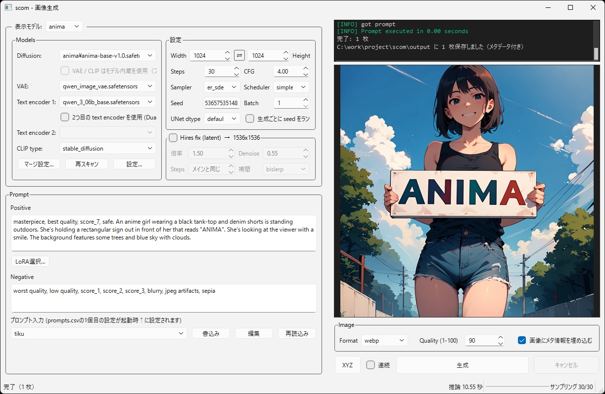

# scom

Windowsにおいて1ウィンドウだけでお手軽に画像生成することを目指したソフトです。  
必須ファイルのダウンロードや環境構築もアプリ上から行えます。  

内部ではComfyUIを利用しています。  
モデルはAnima、Krea2、StableDiffusion XLに対応しています。  

## 特徴
* リリースビルド版はexe内に必要なpythonも含めているため、Windows11であればexeを実行するだけでComfyUIの環境構築がスタートし、利用できるようになります。
* モデルをマージして動かすこともできます。2個だけでなく3個以上のモデルのマージにも対応し、メモリ上もしくはファイルに出力可能。また、アプリ上にレシピを保存できます。
* モデルをfp8、int8convrot、int4convrotに量子化することができます。モデルのマージ時に量子化することもできます。
* LoRAはCivitAIからサムネとトリガーワードを取得してきて、プロンプトにワンクリックで適用できます
* Stable Diffusion WebUIにある自動連続生成やXYZ(複数条件の比較画像作成機能)、HighresFix(latent)に対応しています。
* 画像へメタ情報を付ける、付けないを選択可能です。
* Sage Attensionに対応しています。設定からON/OFFできます。

## 起動方法

### リリースビルド版
scom.exeを実行してください。

### ソースコードから行う場合
Python 3.10 以上が必要です。
run_dev.ps1を右クリックし"PowerShellで実行"をクリックしてください。

## ライセンス

[MIT License](LICENSE)
