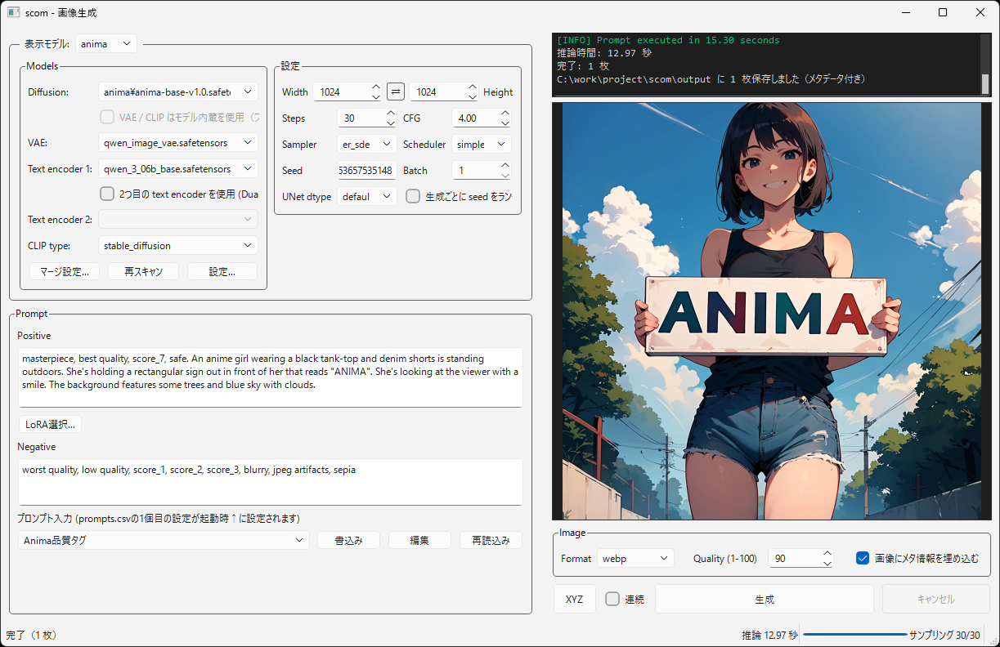

# scom

ComfyUIで1画面でお手軽に画像生成することを目指したComfyUIラッパーソフトです。必須ファイルのダウンロードや環境構築もアプリ上から行えます。  

モデルはAnima、Krea2、StableDiffusion XLに対応しています。  



## 特徴
* 初回起動時にComfyUIやそれの動作に必要な環境を自動でダウンロード＆構築します。また、画像生成するのに必要なモデル(VAEやTE含む)をダウンロードできます(自身で落としたものを動かすこともできます)
* モデルをマージして動かすこともできます。2個だけでなく3個以上のモデルのマージにも対応し、メモリ上もしくはファイルに出力可能。また、アプリ上にレシピを保存できます。
* モデルをfp8、int8convrot、int4convrotに量子化することができます。モデルのマージ時に量子化することもできます。
* LoRAはCivitAIからサムネとトリガーワードを取得してきて、プロンプトにワンクリックで適用できます
* Stable Diffusion WebUIにある自動連続生成やXYZ(複数条件の比較画像作成機能)に対応しています。
* 画像へメタ情報を付ける、付けないを選択可能です。
* Sage Attensionに対応しています。設定からON/OFFできます。


## 起動方法

### リリースビルド版
scom.exeを実行してください。

### ソースコードから行う場合
Python 3.10 以上が必要です。

```powershell
./run_dev.ps1
```


## ライセンス

[MIT License](LICENSE)
